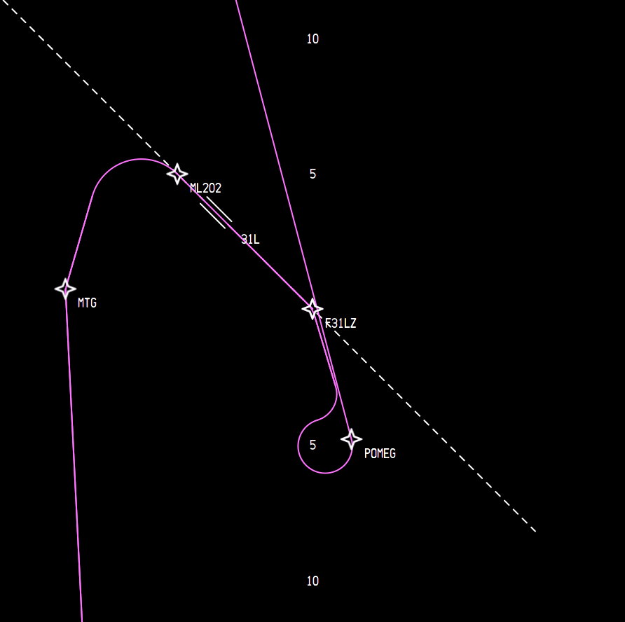

# Flightplan-graphics

This app is intened to be a simulation of a Boeing-like navigation system. Right now there's no GUI for CDU. Only a command interface is provided. For that you can use cmds.txt.
Benchmark scripts can be found inside the benchmarks directory. To use simply replace the contents of cmds.txt. When you first launch the app it will prompt you to enter some paths to the nav data. Those will be stored in the prefs.txt file.

## Getting started

This plugin uses [libnav](https://github.com/BRUHegg/libnav), cairo, gtk and freetype libraries. Make sure you have these installed before you proceed any further.

### Compiling on linux/mac:

1) Make sure you have CMake and g++ installed.
2) Make sure the default CMake compiler is g++. The plugin may not compile if you use something else.
3) Create a "build" directory inside the repository directory and cd into it.
4) Run the following command in the terminal:
```text
cmake .. -DLIBNAV={Your libnav path}
make
```

### Compiling on windows

1) You will need to compile this plugin via minGW using g++. It works the best.
2) You will need to install the following packages in the minGW: CMake, g++
3) Create a "build" directory inside the repository directory and cd into it.
4) Run the following commands in the terminal
```text
cmake .. -G "MSYS Makefiles" -DLIBNAV={Your libnav path}
cmake --build .
```

## Screenshots

You can see some examples of what the app is capable of below:


